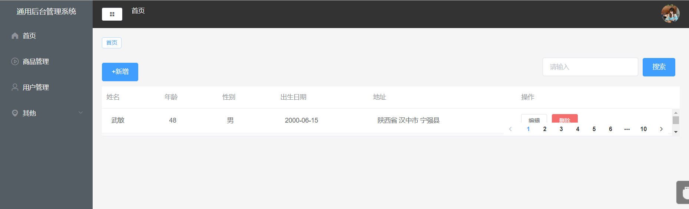
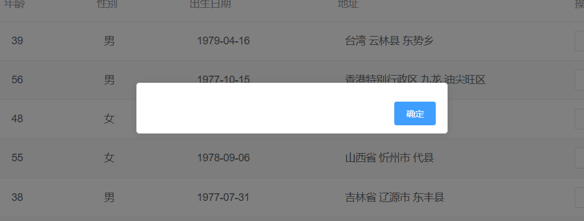
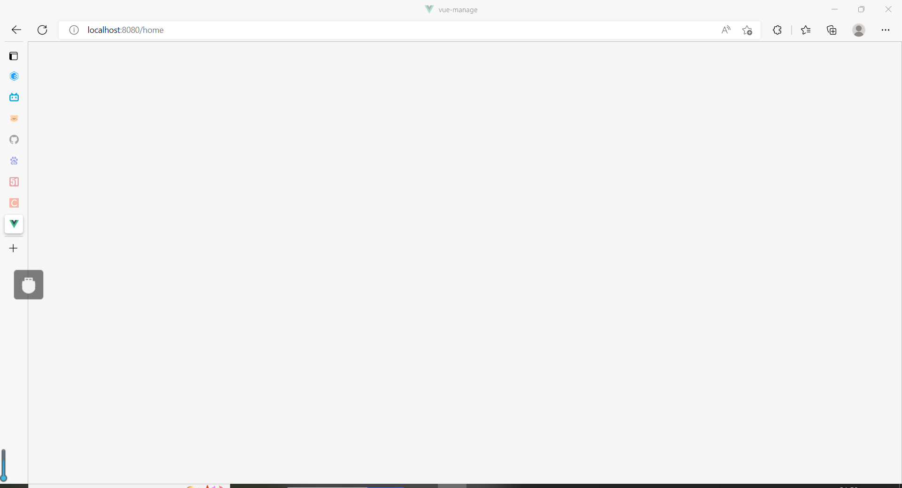

[[toc]]

::: tip
写在开头：学完了Vue之后想做点项目巩固一下知识点，搜寻了一下网上推荐的项目，决定先做个易上手的后台管理系统（这样也方便以后迭代更新成自己想要的管理系统） 本篇文章主要记录那些年我踩过的坑 还有项目中的重点知识
:::

##   一.踩坑总结
# 1. VUE报错：Property or method “scope” is not defined

是因为缺失了 slot-scope=“scope”，造成组件认为 scope 未定义，加上去就行（然而我是因为将scope写成了scoped这样的低级错误:joy:

# 2.VUE报错：Unexpected mutation of “XXX” prop vue/no-mutating-props

::: warning
我们在进行 Vue 开发的时候，经常会遇到一些对可使用 v-model 的组件包装嵌套的需求，但若使用不慎，就会引发 vue/no-mutating-props 的问题。在 v-model 嵌套时的做法，可以避免这个问题。
:::
原因：实际上，v-model 仅仅是一个语法糖而已，它的原理是：父组件通过 props 传入变量，子组件通过事件把更新后的变量值 emit 出来，再由父组件进行事件处理。
所以实质上，在子组件内，我们并**不可以直接将 prop 的变量应用于子组件深层次组件的 v-model 上（因为 v-model 会隐含的对 prop 值更新）**，故肯定会触发错误的。

解决方法：在那个组件里的属性中声明一个变量用来承接props里的父属性，然后把form全部改为你声明的变量
```js
    data () {
        return {
            // 不可以直接将 prop 的变量应用于子组件深层次组件的 v-model 上（因为 v-model 会隐含的对 prop 值更新）
            // 
                 formData: this.form
        }
    }
```
# 3.VUE报错：Parsing error Unexpected token


原因：禁用eslint，webpack打包正常，Parsing error 是eslint解析错误。

**解决方案：**
1.下载 babel-eslint 插件（Npm下载会出错）

**cnpm install babel-eslint --save**

2.在package.json中配置 eslintConfig 属性
```js
"eslintConfig": {
 "extends": "airbnb-base",
 "parser": "babel-eslint"
 }
 ```
 # 4.[Vue warn]: Error in v-on handler: "TypeError: Cannot read properties of undefined (reading 'row')"

原因：这是由于接口调用方法错误，delUser应该使用post方法而不是get方法
 # 5.el-table无法显示正常大小

 

 原因：这个错误就更让人汗颜:grimacing:了,原因是calc函数没有用空格分开
 
 **解决方案：**
 将calc函数用空格隔开 （也再一次警醒了我，写代码一定要仔细仔细再仔细，很多错误检查了半天发现都是拼写or格式错误）

 # 6. Vue element-ui引入MessageBox导致每个页面刷新后均自动弹框问题 

  

  **原因**:在按需引入组件MessageBox时我使用的是：

  ```js
  Vue.use(MessageBox)
  ```
  使用这种加载方式会导致上述问题，具体原因还不是很清楚

  **问题解决**
  把引入组建的方式改为：
  ```js
  Vue.component(MessageBox.name, MessageBox)
  ```
  这样问题就得以解决。
   # 7. 首次刷新页面出现页面白屏情况

 

 **原因**:调用登录接口，成功响应时会进行菜单的设置，此时是**动态路由**，在刷新页面时没有进行菜单动态设置
 ```js
this.$store.commit('addMenu',this.$router)
```
# 8.vue路由跳转错误：Error: Redirected when going from "/" to "/login" via a navigation guard.
 **原因**:这个错误出现在退出登录的时候，真的纠正了很久很久，从一开始排查是否是路由守卫出了问题，或者token出错，一遍又一遍地捋了逻辑，百思不得其解，最后上网搜原因，得知可能是**vue-router**版本问题，遂重新安装了低版本的@vue-router，还是未果，最后检查代码，
 ```js
      clearToken(state) {
            state.token = ''
            Cookie.remove('token')
        }
```

发现是移除cookie的时候，未传参数...闹了个大乌龙，不过好在纠正的时候也学习到了很多关于编程式路由跳转的注意事项和原理，也算是别有一番收获了。
